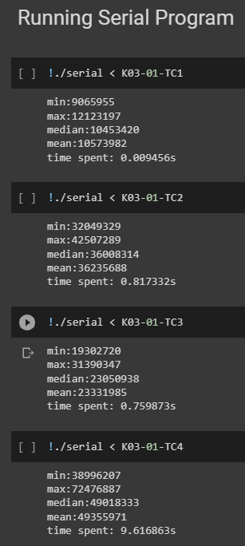
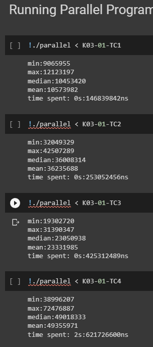

# IF3230_Tubes2

        1. Jelaskan cara kerja program Anda, terutama pada paralelisasi dengan CUDA yang Anda implementasikan berdasarkan skema di atas.

Cara kerja program adalah pertama-tama melakukan pembacaan input dari stdin yang prosesnya persis seperti contoh program serial yang diberikan. Sebelum dilakukan pembacaan, dilakukan pengambilan waktu yang akan digunakan untuk mengukur waktu yang dihabiskan oleh program, proses pengambilan waktu juga dilakukan kembali setelah paralelisasi dan output dari program diberikan. Setelah dilakukan pembacaan input beserta variabel-variabelnya, dilakukan alokasi yang dipanggil oleh _host_ untuk mengalokasikan variabel-variabel yang akan digunakan pada _device_ menggunakan **cudaMalloc**. Variabel-variabel yang dilakukan alokasi ke _device_ adalah sebuah _Matrix_ **target**, sebuah _Matrix_ **kernel**, sebuah _Matrix_ **output**, dan dua integer yang merupakan ukuran kolom dan baris dari _Matrix_ **output** hasil konvolusi. Lalu, dilakukan proses penyalinan dari _host_ ke _device_ yang meliputi _Matrix_ **kernel**, _Matrix_ inisialiasi **output** (berupa _Matrix_ kosong dengan ukuran kolom dan baris matriks output), dan ukuran matriks output. Pada program ini digunakan _**block**_ sebanyak 32 dan jumlah _**thread_per_block**_ yang mengikuti jumlah elemen matriks hasil konvolusi dibagi dengan banyaknya _**block**_ yang dimiliki. Setelah itu, dilakukan iterasi sebanyak matriks input yang diberikan dan dilakukan proses penyalinan _Matrix_ **target** dari _host_ ke _device_ yang diikuti dengan dijalankannya perhitungan konvolusi secara paralel. **Proses paralelisasi konvolusi** yang dilakukan adalah dengan membuat thread yang mendekati (dapat lebih banyak dari) jumlah elemen matriks hasil konvolusi. Setiap thread akan melakukan perhitungan perkalian matriks seperti fungsi _supression_op_ yang diberikan untuk elemen-elemen matriks yang berkorespondensi dari _Matrix_ **input** dengan _Matrix_ **kernel**. Jika terdapat thread dengan indeks yang melebihi ukuran matriks, maka operasi perhitungan konvolusi tidak dilakukan. Setelah didapat hasil konvolusi secara paralel, dilakukan penyalinan kembali _Matrix_ **output** dari _device_ ke _host_ untuk dihitung data range dari hasil tersebut (menggunakan fungsi yang diberikan pada contoh serial.c) dan disimpan pada sebuah array integer yang telah dialokasikan sebelumnya. Proses ini diulang untuk setiap matriks input yang ada. Setelah iterasi seluruh matriks input selesai, dilakukan _sorting_ datarange hasil konvolusi tersebut secara paralel menggunakan algoritma _Brick / Odd-Even Sorting_. **Proses paralelisasi sorting** diawali dengan pengalokasian array sort sejumlah banyaknya target matriks dan dilakukan penyalinan array integer datarange sebelumnya dari _host_ ke _device_. Kemudian, dilakukan perulangan sebanyak jumlah elemen pada array integer datarange. Dalam perulangan tersebut dilakukan sorting dengan metode _Brick / Odd-Even Sorting_ yang akan meng-_swap_ elemen indeks jika belum _sorted_ dan dikategorikan dengan indeksnya yang genap atau ganjil. _Sorting_ ini dilakukan dengan memanfaatkan **block** sejumlah setengah dari jumlah indeks dan 1 **thread**. Setelah proses sorting secara paralel selesai, array hasil sorting dikembalikan ke _host_ dengan menggunakan **cudaMemcpy**. Lalu dihitung median dan mean dari array tersebut menggunakan fungsi yang terdapat di contoh serial.c. Hasil tersebut kemudian dicetak pada command line dengan format yang dapat dilihat pada _screenshot_ dan diikuti dengan waktu yang dihabiskan. Setelah seluruh _output_ berhasil ditampilkan, digunakan _cudaFree_ untuk setiap variabel yang dilakukan _cudaMalloc_ sebelumnya untuk membebaskan/melepaskan memory tersebut.

        2. Dari waktu eksekusi terbaik program paralel Anda, bandingkan dengan waktu eksekusi program sekuensial yang diberikan. Analisis mengapa waktu eksekusi program Anda bisa lebih lambat / lebih cepat / sama saja. Lalu simpulkan bagaimana CUDA memengaruhi waktu eksekusi program Anda. Buktikan dengan menunjukkan waktu eksekusi yang diperlukan saat demo.

Berdasarkan waktu eksekusi yang diperoleh, secara umum **program yang dieksekusi secara paralel lebih cepat atau efisien** dalam menemukan data-data statistik hasil konvolusi matriks dibandingkan dengan program yang dieksekusi secara sekuensial. Hal tersebut dapat dilihat pada waktu yang diperlukan untuk eksekusi program secara paralel dalam menyelesaikan testcase 1; 2; 3; 4. Diambil dari penyelesaian paralel yang memiliki waktu eksekusi tercepat, program membutuhkan waktu 0.147s; 0.253s; 0.425s; 2.622s, sedangkan waktu yang diperlukan untuk eksekusi program secara sekuensial dalam menyelesaikan testcase 1; 2; 3; 4 membutuhkan waktu 0.009s; 0.817s; 0.760s; 9.617s. Waktu-waktu tersebut adalah hasil yang diperoleh saat kami melakukan testing untuk menemukan waktu tercepat. Dapat diperhatikan bahwa walaupun secara umum program yang berjalan secara paralel berjalan lebih cepat, test case 1 yang dijalankan oleh program serial berlangsung lebih cepat. Salah satu faktor yang dapat memengaruhi terjadinya hal ini adalah karena test case 1 yang proses konvolusi matriksnya tidak terlalu berat untuk dilakukan secara sekuensial karena ukuran matriksnya yang tidak terlalu besar. Program paralel yang menambahkan proses paralelisasi untuk konvolusi sayangnya tidak dapat melakukan konvolusi yang lebih cepat dari program serial yang langsung menjalankan konvolusi secara sekuensial. Selain pada kasus test case 1, program paralel menggunakan CUDA dapat mendapatkan hasil lebih cepat karena konvolusi yang dilakukan secara paralel bersifat lebih efisien dengan memanfaatkan block dan thread dari GPU.

Berikut adalah waktu eksekusi yang diperoleh

        3. Jelaskan secara singkat apakah ada perbedaan antara hasil keluaran program serial dan program paralel Anda, dan jika ada jelaskan juga penyebab dari perbedaan tersebut.

Jika jumlah thread yang didefinisikan dalam satu block tidak melebihi batas jumlah thread dalam satu block (1024 thread) atau melebihi batas jumlah block (2^31 - 1), maka tidak akan terdapat perbedaan hasil dari eksekusi program serial & paralel. Dalam kasus uji yang ada, hal tersebut tidak mungkin terjadi karena kami mendefinisikan 32 block pada program dan maksimal jumlah proses yang terjadi adalah 100 baris x 100 kolom atau sama dengan 10000 proses, yang mana 10000 proses tersebut akan dibagi ke 32 block yang berarti setiap blok akan memiliki 313 thread, masih dibawah batas 1024 thread. Ketika melebihi batas tersebut, maka CUDA tidak memiliki kapabilitas untuk melakukan proses komputasi tersebut.

        4. Dengan paralelisasi yang Anda implementasikan, untuk bagian perhitungan konvolusi saja, dari 3 kasus berikut yang manakah yang waktu eksekusinya paling cepat dan mengapa?

            1. Jumlah Matrix: 10000, Ukuran Kernel: 1x1, Ukuran Matrix: 1x1

            2. Jumlah Matrix: 1, Ukuran Kernel: 1x1, Ukuran Matrix: 100x100 [paling cepet]

            3. Jumlah Matrix: 1, Ukuran Kernel: 100x100, Ukuran Matrix: 100x100

            (Note: ketiga kasus memiliki jumlah operasi perkalian yang sama)

Karena kecepatan perhitungan paralelisasi konvolusi berbanding lurus dengan ukuran matriks hasil konvolusi yang dilakukan (karena banyak thread dibuat sebanyak elemen matriks hasil konvolusi yang masing-masing menghitung perkalian konvolusi matriks input dengan matriks kernel yang berkorespondensi), maka kasus ke-2 akan memiliki waktu eksekusi yang paling cepat karena menghasilkan matriks output dengan elemen terbanyak (100*100 elemen) yang seluruh elemen dapat dihitung secara bersamaan oleh setiap thread. Sehingga pada kasus ke-2 akan menjalankan 10.000 perhitungan konvolusi sekaligus secara paralel.

Untuk kasus lainnya tidak akan secepat kasus ke-2 karena alasan sebagai berikut.

Untuk kasus ke-1, perhitungan konvolusi tidak akan terlihat lebih cepat dibandingkan dengan serial karena paralelisasi konvolusi yang dibuat oleh kelompok kami tidak membagi perhitungan berdasarkan jumlah input matriks yang ada. Sehingga akan dilakukan 10.000 kali perhitungan untuk setiap pasangan input matriks dengan kernel matriks secara satu per satu.

Untuk kasus ke-3, perhitungan konvolusi tidak akan lebih cepat dibandingkan dengan kasus ke-2 karena ukuran matriks hasil konvolusi yang dihasilkan adalah 1x1 sehingga hanya terdapat 1 thread yang akan melakukan perhitungan konvolusi sebanyak 10.000 kali.
